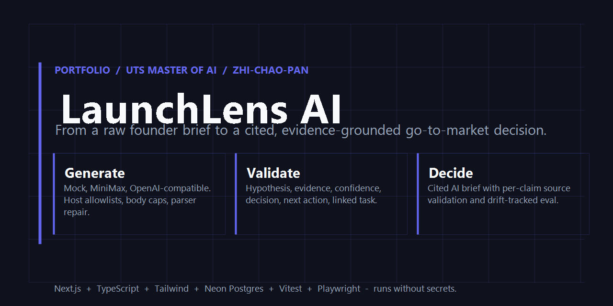
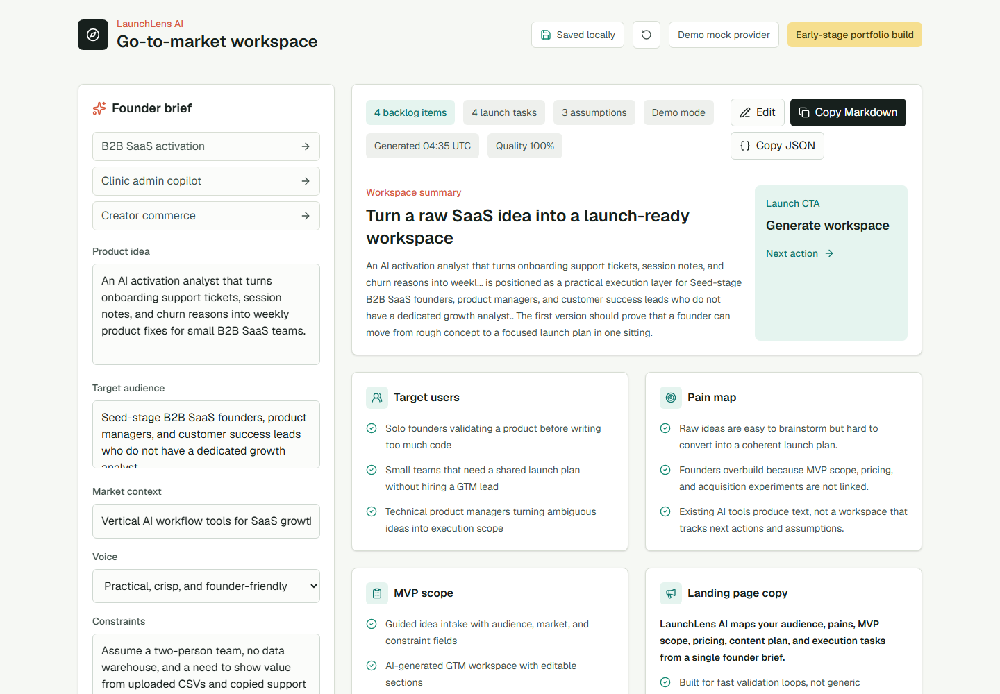
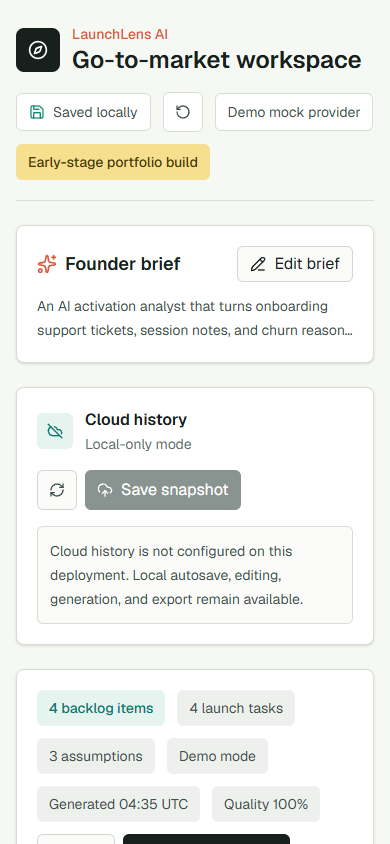

# LaunchLens AI



> Tip: upload `public/og.png` to **Settings -> General -> Social preview** so the GitHub link card uses this same cover. The image is already wired into the Next.js `openGraph` and `twitter` metadata for the live Vercel deployment.


[    ](https://github.com/Zhi-Chao-PAN/launchlens-ai/actions/workflows/ci.yml)

LaunchLens AI is an AI-powered SaaS workspace that turns a raw product idea into an editable go-to-market plan for indie founders, solo builders, and small product teams.

If you only have five minutes, read `ARCHITECTURE.md` and the "How this was built" section below. If you have twenty minutes, read `README.md` end-to-end. If you want the full design history, read `ROADMAP.md`, `TASKS.md`, `PROJECT_MATURITY.md`, and `NIGHTLY_LOG.md` in that order.


The portfolio goal is to show full-stack AI product judgment: product strategy, UX workflow, provider abstraction, secure environment handling, tests, and a path from mock demo to real LLM-backed SaaS. It is not a pure algorithm or notebook project.

## Case Study Snapshot

Problem: early founders often have many product ideas but no coherent path from concept to target user, MVP scope, pricing, launch content, and execution tasks.

Solution: LaunchLens AI converts a founder brief into a workspace that can be generated, edited, and then operated as an evidence loop: assumption -> observation -> confidence -> decision -> next action.

Audience: solo founders, tiny SaaS teams, and technical product managers who need sharp execution before overbuilding.

Current maturity: portfolio-ready. The product loop is generate -> edit -> collect evidence -> synthesize an evidence-grounded AI decision brief -> link execution -> save/recover/share -> export.

## Product Preview



<p align="center">
  
</p>

## Current Product Flow

1. Choose a stable example workspace or write a new founder brief.
2. Generate a go-to-market workspace using the mock provider by default.
3. Review target users, pain map, MVP scope, feature backlog, launch plan, pricing, risks, assumptions, content calendar, and execution tasks.
4. Review each assumption as a validation experiment, add evidence, set confidence, record a decision, and link the next execution task.
5. Generate an AI decision brief that cites only recorded evidence and separates recommendation, evidence strength, grounded claims, unresolved risks, and next actions.
6. Toggle edit mode and refine generated sections.
7. Keep the current brief, workspace, and private validation record across refreshes through browser-local persistence.
8. When `DATABASE_URL` is configured, save decision-point snapshots, restore history, and explicitly enable a privacy-safe read-only share link.
9. Generate a recovery key, link the current cloud history, and recover the same capability account after browser storage is cleared or on another device.
10. When cloud storage is absent, continue in a clearly labeled local-only mode without losing generation, validation, editing, or export.
11. Watch generation progress and provider metadata without exposing any secret or upstream response detail.
12. Copy/export the private workspace, evidence record, and current decision briefs as Markdown or JSON.

## Keyboard Shortcuts

LaunchLens includes power-user keyboard shortcuts for fast workflow navigation:

| Shortcut | Action |
|----------|--------|
| `Cmd/Ctrl + Enter` | Generate workspace while the brief textarea is focused |
| `G` | Generate workspace from current brief |
| `E` | Toggle edit / preview mode |
| `Cmd/Ctrl + S` | Scroll to cloud save section |
| `B` | Open founder brief and focus input |
| `Cmd/Ctrl + M` | Copy workspace as Markdown |
| `Cmd/Ctrl + Shift + R` | Reset workspace to initial example |
| `Cmd/Ctrl + H` | Replay the quick-start tour |
| `?` / `Shift + ?` | Show this keyboard shortcuts panel |
| `Esc` | Close the topmost open modal / dialog / toast |
| `Shift + Esc` | Dismiss all toasts at once |
| `Shift`+click Copy Markdown | Download the shared workspace as a `.md` file instead of copying to clipboard |

Press `?` anywhere in the app to see the shortcuts help panel. Shortcuts are automatically disabled when typing in inputs or textareas to avoid conflicts.

## Demo Script

1. Start the app with `npm run dev`.
2. Select the `B2B SaaS activation` sample brief.
3. Click `Generate workspace`.
4. In `Validation loop`, review the first evidence-backed hypothesis and its product decision.
5. In `AI decision copilot`, inspect the evidence-bound recommendation and grounded claims.
6. Click `Regenerate brief` and confirm the brief is saved without exposing provider internals.
7. Add evidence to another hypothesis, set confidence, record a decision/next action, and link an execution task.
8. Refresh the page and confirm the private evidence record is restored.
9. Click `Copy Markdown` or `Copy JSON` and inspect the complete execution handoff.
10. On a database-enabled deployment, save a snapshot, generate a recovery key, link the history, clear browser storage, and recover it with the same handle/key pair.
11. Explicitly confirm a read-only share that excludes evidence notes, sources, founder input, and private AI decision briefs.

## Stable Demo Fixtures

The app includes deterministic example workspaces for B2B SaaS activation, clinic admin, and creator commerce. Their validation stories intentionally cover supported, testing, and refuted hypotheses so reviewers can inspect product judgment immediately.

## Evidence Loop Design

- Provider output stays focused on the generated GTM schema; evidence is post-generation user state rather than invented model evidence.
- Assumptions and tasks use stable identities so reorder/insert operations cannot silently move evidence to another hypothesis.
- Validation progress is distinct from generated-workspace quality.
- Evidence records are bounded by item count, field length, and total normalized snapshot size.
- Private local/cloud snapshots and Markdown/JSON exports include evidence details.
- The AI decision copilot consumes evidence as untrusted data and every generated claim must cite exact evidence IDs.
- Decision briefs are invalidated when the underlying experiment evidence changes.
- Private local/cloud snapshots and Markdown/JSON exports include current decision briefs.
- Public shares include status, confidence, decisions, next actions, linked tasks, and evidence counts only; evidence notes, sources, founder input, and AI decision briefs remain private.

## Tech Stack

- Next.js App Router
- TypeScript
- Tailwind CSS
- Vitest
- Server route handlers for generation, decision synthesis, and workspace persistence
- Optional Neon Postgres cloud history through `@neondatabase/serverless`
- Mock/demo provider by default
- Optional OpenAI-compatible provider through server-side environment variables
- Optional MiniMax Token Plan provider through server-side environment variables

## AI Provider Design

LaunchLens AI always runs without secrets.

- `mock` mode returns deterministic demo output so reviewers can run the project immediately.
- `minimax` mode is enabled only when `MINIMAX_API_KEY` exists on the server.
- `openai` mode is enabled only when `OPENAI_API_KEY` exists and MiniMax is not configured.
- Real provider failures return a safe fallback code and mock output, not upstream response details.
- Provider calls use HTTPS base URL validation, host allowlists, request timeouts, field caps, body caps, and a lightweight demo rate limit.
- Provider parsing accepts fenced JSON, strips reasoning tags, repairs minor JSON formatting issues, and falls back safely when core structure is missing.
- Real provider output must include the complete workspace schema; incomplete output falls back instead of receiving a misleading mock-filled quality score.
- The UI shows safe generation metadata such as mode, generated time, and fallback code, but never provider secrets.
- Workspace quality is scored with deterministic checks for summary, users, pains, MVP scope, backlog, landing copy, pricing, launch plan, tasks, and assumptions.
- The decision copilot uses deterministic mock briefs by default. Live real-provider decision briefs require both a real provider key and `DECISION_COPILOT_LIVE_ENABLED=true`.
- Decision-brief validation rejects invented evidence IDs, overlong fields, stale source fingerprints, and incomplete provider payloads.

## Visual Regression and Decision Trend

The production build is verified against committed design baselines, and decision-brief quality is tracked across runs.

```bash
npm run visual:regression -- --url https://launchlens-ai-two.vercel.app --tolerance 0.05
```

The script uses Playwright to capture the desktop (1440x900), mobile (390x844), and pricing (1280x800) viewports, diffs them against `public/screenshots/launchlens-*.png`, and writes a JSON report. Pass `--update-baseline` to refresh the committed baselines. The GitHub Actions workflow `hosted-visual-regression` runs the same check on every push to `main` and uploads the report as a build artifact.

Decision-brief evaluation feeds a per-run history file, a sliding-window drift gate, and a static dashboard:

```bash
npm run eval:decision -- --write-history
npm run decision:history -- --window --size 5 --drift-threshold 5
npm run decision:history -- --dashboard
```

The history snapshots are committed to `fixtures/providers/decision-history/`, the dashboard is rendered to `docs/decision-dashboard.html`, and the GitHub Actions workflow `CI` runs the 5-run window as a release gate (any scenario whose quality drifts down by more than 5 points fails the build) and uploads the latest dashboard as a build artifact. The `--prune` flag keeps the history directory at 90 days of retention with at least 10 entries preserved.

## Team Collaboration (RBAC)

When a database is configured, the workspace owner can invite other capability accounts to the same workspace as `editor` (can save snapshots and toggle the public share link) or `viewer` (can read the workspace and its decision briefs but cannot mutate it). Membership uses the same `x-launchlens-owner` header as the existing recovery flow, and the new `/api/workspaces/[id]/members` and `/api/workspaces/invites/accept` routes re-use the existing body, schema, and rate-limit guards.

`npm run smoke:rbac` exercises the full RBAC path against a database-enabled deployment: owner invites viewer, viewer accepts, viewer can read but is forbidden from toggling the public share (HTTP 403), then owner deletes the workspace.

## Provider Evaluation

The repository includes a repeatable provider eval over three public scenarios:

- B2B SaaS activation
- Clinic administration with privacy and human-approval constraints
- Creator commerce with a 10-day launch constraint

The default command always clears provider variables and evaluates mock mode:

```bash
npm run eval:provider
```

Live MiniMax evaluation is deliberately explicit:

```bash
npm run eval:provider -- --live --write-fixture
```

The live command requires server-side `MINIMAX_*` variables. It prints metrics only, rejects fallback or incomplete schemas, checks scenario compliance, scans for secret-like values, and atomically writes `fixtures/providers/minimax-m3-public-samples.json`. Standard CI runs only the no-secret mock eval.

The MiniMax integration follows the official [Responses API](https://platform.minimaxi.com/docs/api-reference/responses-create) request fields.

## Decision Copilot Evaluation

Decision briefs have their own repeatable eval gate because the product risk is different from workspace generation. The eval checks citation fidelity, evidence-signal alignment, recommendation direction, evidence strength, no-fallback behavior, and scenario-specific behavior across supported, neutral, and challenged evidence.

The default command always clears provider variables and evaluates deterministic mock mode:

```bash
npm run eval:decision
```

Live MiniMax decision evaluation is explicit and can update the public fixture:

```bash
npm run eval:decision -- --live --write-fixture
```

The persisted fixture lives at `fixtures/providers/minimax-m3-decision-samples.json`. It contains public sample evidence, safe metadata, and MiniMax decision outputs only; it is scanned for secret-like values before writing. Standard CI runs only the no-secret mock decision eval.

Optional local provider variables:

```bash
MINIMAX_API_KEY=
MINIMAX_MODEL=MiniMax-M3
MINIMAX_BASE_URL=https://api.minimaxi.com/v1

DECISION_COPILOT_LIVE_ENABLED=true

OPENAI_API_KEY=
OPENAI_MODEL=gpt-4.1-mini
OPENAI_BASE_URL=https://api.openai.com/v1
```

Do not commit `.env.local` or any secret values.

## Cloud Workspace Design

Cloud history is optional. A fresh clone and the public demo still render and run in local-only mode when no database is configured.

- The browser starts with a 256-bit anonymous owner token and keeps it in local storage.
- A user can generate a recovery key and combine it with a normalized handle to derive the same capability account on another browser.
- The recovery key is never persisted by the app or sent to the server. Only the derived owner credential reaches same-origin workspace routes.
- The server stores only the owner credential's SHA-256 hash, never its plaintext value.
- Recovery migration locks both owner identities transactionally, preserves the 20-snapshot account quota, and revokes the previous browser credential.
- Each anonymous or recovery-linked identity can keep up to 20 snapshots.
- A transaction-level global capacity gate prevents an anonymous beta from growing storage without an upper bound.
- Sharing is disabled by default and must be explicitly enabled per snapshot.
- Shared pages expose a read-only workspace and validation summary, not the owner token, founder brief, evidence notes, or evidence sources.
- Streaming body limits, nested field/cardinality limits, known-field normalization, UUID validation, owner-scoped queries, safe error codes, atomic quotas, and mutation throttling protect the public API surface.
- Mutation limits use a SHA-256 client bucket in Neon so the 20-per-minute gate is shared across serverless instances; local-only mode retains a bounded in-process fallback.
- Application logs emit fixed event codes rather than request bodies, owner credentials, provider responses, or database connection values.
- Runtime routes use DML only. Schema DDL is isolated in an explicit migration command so production can use a least-privilege runtime role.

Vercel Marketplace Neon injects `DATABASE_URL` automatically. Run the migration once after provisioning:

```bash
npm run db:migrate
npm run verify:cloud-db
```

Use `DATABASE_MIGRATION_URL` for an elevated migration role when available, and keep the runtime `DATABASE_URL` limited to table DML.

After a database-enabled deployment, verify the full cloud flow with:

```bash
LAUNCHLENS_BASE_URL=https://your-deployment.example.com npm run release:cloud
```

The cloud release gate migrates the database, verifies the expected schema contract, then runs workspace recovery/share/privacy, tenant isolation, and RBAC smoke checks. The workspace smoke creates a temporary workspace, restores it, migrates it to a recovery account, proves the previous credential lost access, verifies tenant-scoped recovery visibility, enables a public expiring share, checks that private evidence and decision-brief details are not exposed, disables sharing, and deletes the workspace.

## Security Boundaries

- Capability credentials are high entropy, same-origin only, and stored server-side only as hashes.
- Recovery is deliberately password-manager friendly and registration-free; possession of the handle/key pair is the authentication factor.
- Recovery keys are masked by default, can be copied explicitly, and are not stored by LaunchLens AI.
- Database quotas and owner migration use advisory locks to keep concurrent writes within account and global capacity.
- Public shares use a dedicated SQL projection that never selects founder input, evidence notes/sources, or private AI decision briefs.
- Provider and storage errors return fixed safe codes. Tests assert unexpected errors cannot echo owner credentials into application logs.
- Standard CI and all reviewer flows remain no-secret. Live provider evals are explicit opt-in operations.

## Run Locally

```bash
npm install
npm run dev
```

Open `http://localhost:3000`.

## Live Demo

[launchlens-ai-two.vercel.app](https://launchlens-ai-two.vercel.app)

## Release Candidate

Current RC evidence, promotion checklist, and demo flow are tracked in
[`docs/RELEASE_CANDIDATE.md`](docs/RELEASE_CANDIDATE.md).

Production promotion and rollback steps are tracked in
[`docs/PRODUCTION_RUNBOOK.md`](docs/PRODUCTION_RUNBOOK.md). The polished
portfolio walkthrough is tracked in
[`docs/DEMO_SCRIPT.md`](docs/DEMO_SCRIPT.md).
The production-stage handoff packet is tracked in
[`docs/PRODUCTION_RELEASE_PACKET.md`](docs/PRODUCTION_RELEASE_PACKET.md).
For a hosted pre-promotion audit, run the GitHub Actions workflow
`Release candidate verification`.

## Validate

```bash
npm run lint
npm run test
npm run verify:release-readiness
npm run release:local
npm run evidence:release # writes ignored Markdown/JSON release evidence
npm run eval:provider
npm run eval:decision
npm run smoke:cloud # only against a database-enabled deployment
npm run smoke:tenant # only against a database-enabled deployment
npm run smoke:rbac # only against a database-enabled deployment
npm run verify:public-demo # checks the public URL status endpoint
npm run verify:cloud-db # only after configuring a database
npm run db:migrate # only after configuring a database
npm run build
npm audit --audit-level=moderate
```

## Architecture



```mermaid
flowchart LR
  A["Founder brief"] --> B["Next.js client workspace"]
  B --> C["/api/generate route"]
  C --> D{"Provider env?"}
  D -->|"none"| E["Mock provider"]
  D -->|"MINIMAX_API_KEY"| F["MiniMax Responses API"]
  D -->|"OPENAI_API_KEY"| G["OpenAI-compatible chat completions"]
  F --> H["Safe parser and schema checks"]
  G --> H
  H --> I["Editable GTM workspace"]
  E --> I
  I --> J["Assumptions"]
  J --> K["Evidence and confidence"]
  K --> L["/api/decision"]
  L --> T{"Live decision enabled?"}
  T -->|"false"| U["Evidence-bound mock brief"]
  T -->|"true + provider key"| V["Real provider decision brief"]
  U --> W["Per-claim citation validation"]
  V --> W
  W --> X["Decision and linked task"]
  X --> M["Browser local storage / private export"]
  X --> N["/api/workspaces"]
  N --> O{"DATABASE_URL?"}
  O -->|"configured"| P["Neon snapshot history"]
  O -->|"absent"| Q["Explicit local-only mode"]
  N --> Y["Shared Neon mutation limit"]
  P --> R["Owner-scoped restore"]
  P --> S["Privacy-safe read-only share"]
  P --> Z["Recovery-key account migration"]
```

## Portfolio Positioning

This project is built for Zhi-Chao-PAN's UTS Master of Artificial Intelligence application as a high-quality AI SaaS portfolio artifact. It emphasizes AI full-stack product development and technical product management rather than isolated model research.


## How this was built

This is a single-author portfolio build that took three evening sessions over three Asia/Shanghai days, with the work split between product phases and CI hardening.

- Total human time on this repository: approximately 8 to 10 hours of focused authoring plus the time spent reviewing Playwright traces, Vercel deployment logs, and the local Neon production smoke.
- Total commits: 48 at the time of the portfolio release. Roughly two thirds of the commits are real product, security, or evaluation work; the rest are CI and lockfile fixes that came from running the standard pipeline against a fresh clone on a different OS/Node version than the dev machine. The exact commit count will keep growing as the post-portfolio enhancements land; this sentence is intentionally a snapshot, not a moving claim.
- The eleven CI and lockfile commits are not pad commits. They came from three real environment crossings: a first GitHub Actions run that discovered lockfile drift, a Playwright install on Ubuntu that introduced optional native `@emnapi/*` deps requiring a lockfile regeneration, and a Chromium rendering mismatch between the Windows-captured baselines and the hosted CI renderer. Each commit message names the underlying cause so the trail is readable.
- I chose to scope this portfolio release around a single founder workflow with a registration-free capability account. A full OAuth identity, team workspaces, billing, and a hosted pricing page were considered and intentionally deferred. See the re-entry cost note in `PROJECT_MATURITY.md` for what the conversion to a real commercial SaaS would require.
- Reviewers who want a quick read of the engineering signals behind the project can scan the Phase coverage table below; reviewers who want the design intent can read `ARCHITECTURE.md`; reviewers who want the build diary can read `NIGHTLY_LOG.md`.

## Phase coverage

| What this project is meant to demonstrate | Where the evidence lives |
| --- | --- |
| LLM product integration beyond prompt-and-pray | Phase 1 mock + OpenAI-compatible + MiniMax Responses API with host allowlists, body caps, timeouts, and parser repair (`src/lib/launchlens/provider*.ts`, `src/lib/launchlens/provider-runtime.ts`) |
| LLM output controllability and anti-hallucination | Phase 4A evidence-grounded decision copilot + Phase 4B decision eval that checks citation fidelity, source fingerprint match, recommendation direction, and no-fallback behavior (`src/lib/launchlens/decision-eval.ts`, `scripts/evaluate-decision.ts`) |
| Security, authorization, multi-tenant awareness | Phase 5B capability account migration with advisory locks, Phase 5A owner-scoped Neon SQL, rate limits, public-share projection, and a security review pass documented in `NIGHTLY_LOG.md` |
| Production engineering (CI, lockfile, cross-platform) | Phase 6 hosted visual regression workflow, decision trend gate, and the eleven real CI/lockfile commits that close the gap between a Windows dev machine and the GitHub Ubuntu runner |
| Decision traceability, not black-box AI | Phase 3B evidence + linked task trail, Phase 4A per-claim citation validation, Phase 4B history snapshots and trend diff (`fixtures/providers/decision-history/`) |
| Data persistence with graceful degradation | Phase 5A Neon cloud history + Phase 3A local-only fallback, both behind one capability account; quota-safe atomic migration in `src/lib/launchlens/workspace-store.ts` |

## Architecture

A separate `ARCHITECTURE.md` collects the product, persistence, and security diagrams in one place. The short version:

```
[Brief] -> [Workspace] -> [Evidence Loop] -> [Decision Copilot] -> [Decision Brief]
                                  |                  |
                                  v                  v
                          [Provider Eval]      [Decision Eval]
                                  |                  |
                                  +--------+---------+
                                           v
                              [Cloud Persistence + Recovery]
```

See `ARCHITECTURE.md` for the full set of data-flow, gate, and security diagrams.

## License

MIT License. See `LICENSE`.

See:

- `ARCHITECTURE.md`
- `ROADMAP.md`
- `TASKS.md`
- `PROJECT_MATURITY.md`
- `NIGHTLY_LOG.md`


