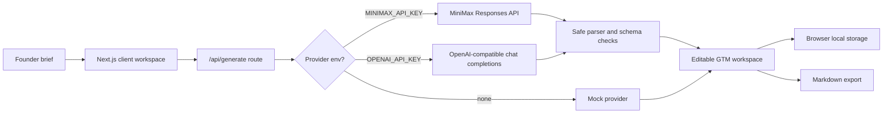

# LaunchLens AI

[](https://github.com/Zhi-Chao-PAN/launchlens-ai/actions/workflows/ci.yml)

LaunchLens AI is an AI-powered SaaS workspace that turns a raw product idea into an editable go-to-market plan for indie founders, solo builders, and small product teams.

The portfolio goal is to show full-stack AI product judgment: product strategy, UX workflow, provider abstraction, secure environment handling, tests, and a path from mock demo to real LLM-backed SaaS. It is not a pure algorithm or notebook project.

## Case Study Snapshot

Problem: early founders often have many product ideas but no coherent path from concept to target user, MVP scope, pricing, launch content, and execution tasks.

Solution: LaunchLens AI converts a founder brief into a workspace that can be generated, edited, reviewed for assumptions/risks, and exported as Markdown.

Audience: solo founders, tiny SaaS teams, and technical product managers who need sharp execution before overbuilding.

Current maturity: early-stage, but now beyond a static scaffold. The product loop is generate -> edit -> validate assumptions -> save locally -> export.

## Product Preview


<p align="center">
  
</p>

## Current Product Flow

1. Choose a stable example workspace or write a new founder brief.
2. Generate a go-to-market workspace using the mock provider by default.
3. Review target users, pain map, MVP scope, feature backlog, launch plan, pricing, risks, assumptions, content calendar, and execution tasks.
4. Toggle edit mode and refine generated sections.
5. Keep the current brief and workspace across refreshes through browser-local persistence.
6. Watch generation progress and provider metadata without exposing any secret or upstream response detail.
7. Copy/export the workspace as Markdown or JSON for a README, Notion doc, product memo, automation, or launch plan.

## Demo Script

1. Start the app with `npm run dev`.
2. Select the `B2B SaaS activation` sample brief.
3. Click `Generate workspace`.
4. Review the assumptions and pricing risks to show that the output is not just marketing copy.
5. Click `Edit`, change one assumption or landing page line, then click `Preview`.
6. Refresh the page and confirm the local workspace is restored.
7. Click `Copy Markdown` or `Copy JSON` and inspect the generated export text.

## Stable Demo Fixtures

The app includes deterministic example workspaces for the B2B SaaS activation, clinic admin, and creator commerce scenarios. They give reviewers a repeatable product walkthrough alongside the hosted demo and screenshot set.

## Tech Stack

- Next.js App Router
- TypeScript
- Tailwind CSS
- Vitest
- Server route handler for generation
- Mock/demo provider by default
- Optional OpenAI-compatible provider through server-side environment variables
- Optional MiniMax Token Plan provider through server-side environment variables

## AI Provider Design

LaunchLens AI always runs without secrets.

- `mock` mode returns deterministic demo output so reviewers can run the project immediately.
- `minimax` mode is enabled only when `MINIMAX_API_KEY` exists on the server.
- `openai` mode is enabled only when `OPENAI_API_KEY` exists and MiniMax is not configured.
- Real provider failures return a safe fallback code and mock output, not upstream response details.
- Provider calls use HTTPS base URL validation, host allowlists, request timeouts, field caps, body caps, and a lightweight demo rate limit.
- Provider parsing accepts fenced JSON, strips reasoning tags, repairs minor JSON formatting issues, and falls back safely when core structure is missing.
- The UI shows safe generation metadata such as mode, generated time, and fallback code, but never provider secrets.
- Workspace quality is scored with deterministic checks for summary, users, pains, MVP scope, backlog, landing copy, pricing, launch plan, tasks, and assumptions.

Optional local provider variables:

```bash
MINIMAX_API_KEY=
MINIMAX_MODEL=MiniMax-M3
MINIMAX_BASE_URL=https://api.minimaxi.com/v1

OPENAI_API_KEY=
OPENAI_MODEL=gpt-4.1-mini
OPENAI_BASE_URL=https://api.openai.com/v1
```

Do not commit `.env.local` or any secret values.

## Run Locally

```bash
npm install
npm run dev
```

Open `http://localhost:3000`.

## Live Demo

[launchlens-ai-two.vercel.app](https://launchlens-ai-two.vercel.app)

## Validate

```bash
npm run lint
npm run test
npm run build
npm audit --audit-level=moderate
```

## Architecture



## Portfolio Positioning

This project is built for Zhi-Chao-PAN's UTS Master of Artificial Intelligence application as a high-quality AI SaaS portfolio artifact. It emphasizes AI full-stack product development and technical product management rather than isolated model research.

## License

MIT License. See `LICENSE`.

See:

- `ROADMAP.md`
- `TASKS.md`
- `PROJECT_MATURITY.md`
- `NIGHTLY_LOG.md`
